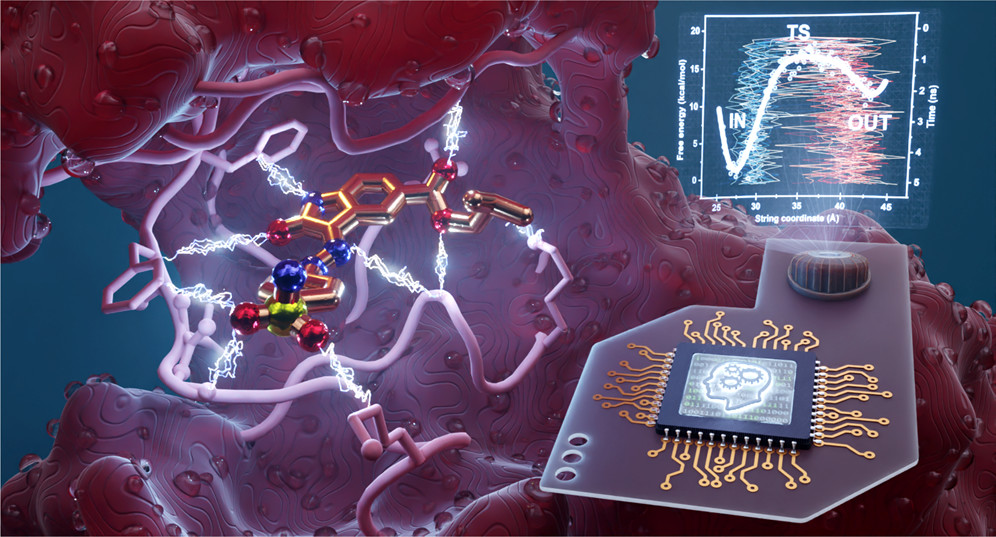

Ligand Unbinding
--------------------


This is an iterative ligand-protein unbinding repository
for the method detailed in:
[*J. Chem. Theory Comput.* 2022, 18, 4, 2543–2555](https://pubs.acs.org/doi/full/10.1021/acs.jctc.1c00924)

*Although this method has been successfully applied to a
list of cases by the developers, it has not been thoroughly
tested. Feel free to report problems and unexpected behaviour
in the issues.*

## Dependencies

##### Python
Check `requirements.txt` 

##### VMD
The optional output for visualisation works with version 1.9.1.  
pbctools package needed (works with 2.6 version)  

---

## Walk-through

### A. Initial unbiased MD simulation
1. Generate the structure from pdb, homology model, etc  
2. Set up your system with your favorite method (for example charmm-gui or amber)
3. Run *x* ns (for example 20 ns, 10000000 steps) of free MD simulations  
In this project we are using NAMD for the MD simulations  
Folder name (for future reference): traj_0, copy the trajectory
there as traj_0.dcd. Similarly, copy rename the `coor`, `vel` and `xsc` files.
4. Copy the namd input of the unbiased run to the working directory and name it `template.inp`.
The following keywords are going to be overwritten: `outputName`, `binCoordinates`, `binVelocities`,
`extendedSystem`, `dcdfreq`, `colvars`, `colvarsConfig`, `run`.
Make sure that the rest of references are appropriate, running from the `traj_$i`
directories.
5. Also copy the `toppar` folder to the working directory.
6. If the ligand has some symmetry, you may cluster atoms to be treated as one
functional group to avoid artefacts. Write space-separated atom names in one line
to define a cluster in `toppar/LIG_clusters.dat`.

The working directory should look similar:
```
├── template.inp
├── toppar
│   ├── cam.str
│   ├── complex.psf
│   ├── lig.prm
│   ├── LIG_clusters.dat
│   ├── par_all36_carb.prm
.   .
.   .
.   .
│   └── toppar_water_ions.str
└── traj_0
    ├── traj_0.dcd
    ├── traj_0.restart.coor
    ├── traj_0.restart.vel
    └── traj_0.restart.xsc
```

### B. Unbinding Iteration

7. The script analyses the trajectory obtained from the previous step and calculate distances
to be included or excluded in the CVs.
    ```bash
    python main.py
    ``` 
Options:

| Flag             | Argument |           Default |
|------------------|:---------|------------------:|
| --trajectory  -t | int      | "last trajectory" |
| --lig         -l | string   |               LIG |
| --top            | string   |            "find" |
| --cutoff      -c | float(Å) |               3.5 |
| --maxdist     -m | float(Å) |               9.0 |
| -ns              | int(ns)  |                10 |
| --cumulative     | Boolean  |             False |
| --writeDCD       | Boolean  |             False |
| --stride      -s | int      |                 5 |
| --processonly -p | Boolean  |             False |
| --nosave         | Boolean  |             False |
| --report         | Boolean  |             False |
| --auto           | Boolean  |             False |
| --maxiter        | int      |                25 |
| --namd           | string   |              None |

`--trajectory`
Which trajectory to analyze. Finds the latest `traj_$i` folder unless specified.

`--lig` (default=LIG)
Define the ligand resname, correspond in the resname present in the psf/prmtop/pdb file.

`--top` (default="find")
Define the topology file. If not specified, the script checks if the following files exist:
`toppar/complex.prmtop`, `toppar/complex.psf`, `toppar/complex.pdb`

`--cutoff` (default=3.5)
Initial cutoff for identifying neighbours in Å. The script analyses the last trajectory and
if in more than 50% of the frames the distance appears, that distance will be included in
the new set of CVs.

`--maxdist` (default=9.0)
Cutoff for excluding contacts in Å.

`-ns` (default=10)
Length of the biased simulations.

`--cumulative` 
Rerun for all the trajectories till the one defined in the `--trajectory` argument.

`--writeDCD`
Write a new DCD strided.

`--stride` (default=5)
Define how many frame to skip when analysing the DCD trajectory.

`--processonly` (default=False)
Do not write VMD and NAMD input. Other outputs will be written.

`--nosave` (default=False)
Do not save the checkpoint. For debug only.

`--report` (default=False)
Prints the configuration saved in the checkpoint file and exits.

`--auto` (default=False)
The program goes to the background and waits for namd to finish. Then it 
processes the results and submits the next iteration, until the `--maxiter`
(default=25) is reached.

`--namd` (default=None)
Path to the namd submission script, must be given with `--auto`. The script has to be an executable,
taking `traj_$i.inp` as an argument, producing `traj_$i.out` as an output.

### Output generated:
Main folder
- `unbinding.out`
    Provides all the distances used as sum for the CVs used in the trajectories, and a summary
    of the distances excluded for the next trajectory
    
- `distances_traked.csv`
    Summary file tracking all the distances included and excluded

- `.checkpoint`
    Binary file with all the information stored
    
New `traj_$i` folder:
- `traj_$i.inp` input file for NAMD simulation
- `sum_$i.col` Colvar file for NAMD sumulation  
 
8. Run the simulation
  
9. Repeat from 7-8 until the ligand is completely onbound and the CV is empty.  

## C. String Setup

The option `-step string` attempts to create colvar files
for a subsequent finite temperature string calculation.
*This function is experimental.*